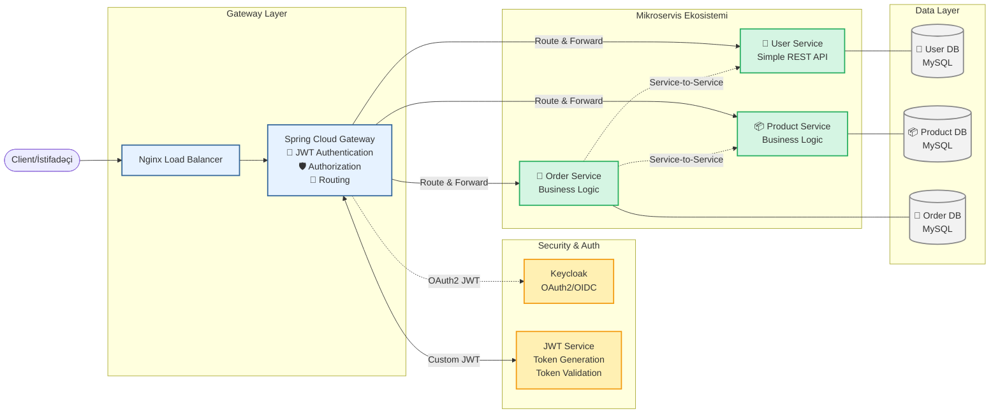

# Mikroservis Arxitekturalı Tətbiq

[](https://www.java.com)
[](https://spring.io/projects/spring-boot)
[](https://spring.io/projects/spring-cloud)
[](https://www.docker.com/)
[](https://jwt.io/)
[](https://opensource.org/licenses/MIT)

Bu layihə, Spring Boot, Spring Cloud Gateway, Docker və JWT istifadə edərək qurulmuş müasir bir mikroservis tətbiqidir. Sistem, **mərkəzləşdirilmiş authentication**, **Spring Cloud Gateway-based routing**, **JWT token management**, **load balancing** və hər servis üçün müstəqil verilənlər bazası kimi xüsusiyyətlərə malikdir.

## 🏗️ Yenilənmiş Arxitektura Baxışı

**Yeni arhitektura xüsusiyyətləri:**
- 🔐 **Mərkəzləşdirilmiş Authentication** - Spring Cloud Gateway-də JWT-based authentication
- 🚪 **API Gateway Pattern** - Bütün sorğular gateway üzərindən keçir
- 🔒 **Microservice Security** - User-ms sadə REST API, security gateway-də
- 🌐 **Hybrid Authentication** - Həm OAuth2/Keycloak, həm də JWT dəstəyi



## 🔐 İki Qat Security Sistemi

### **1. JWT-based Authentication (Əsas sistem)**
- **Token Generation**: Spring Cloud Gateway-də JWT token yaradılması
- **Password Validation**: User service-dən alınan məlumatlarla parol yoxlanılması  
- **Stateless Authentication**: Database-ə müraciət etmədən token doğrulanması
- **Custom Claims**: User ID, email, role və digər məlumatlar

### **2. OAuth2/Keycloak Support (İxtiyari)**
- **External Identity Provider**: Keycloak server integration
- **OIDC Support**: OpenID Connect protokolu
- **Role-based Access**: Keycloak realm-ından role mapping
- **Enterprise Ready**: Böyük təşkilatlar üçün hazır

## 💻 Texnologiya Steki

### **Core Technologies**
- **Backend:** Java 21, Spring Boot 3.x, Spring Cloud 2023.x
- **API Gateway:** Spring Cloud Gateway (WebFlux-based)
- **Authentication:** JWT (JsonWebToken) + OAuth2/Keycloak
- **Database:** MySQL 8.0 (mikroservis başına ayrı instans)

### **Security & Communication**
- **Primary Auth:** Custom JWT with BCrypt password hashing
- **Secondary Auth:** Keycloak OAuth2/OIDC (opsional)
- **Service Communication:** Spring WebClient (Reactive)
- **Load Balancing:** Nginx + Spring Cloud Gateway

### **DevOps & Documentation**
- **Containerization:** Docker, Docker Compose
- **API Documentation:** SpringDoc OpenAPI 3 (Swagger UI)
- **Monitoring:** Spring Boot Actuator
- **Build Tool:** Gradle 8.x with Multi-Module setup

## 🚀 Quraşdırma və İşə Salma

### İlkin Tələblər
- **JDK 21** (Amazon Corretto və ya Oracle JDK)
- **Docker & Docker Compose** (v4.0+)
- **Gradle 8.x** (wrapper daxildir)
- **Git** (repository klonlamaq üçün)

### Quraşdırma Addımları

1. **Repository klonlama:**
   ```bash
   git clone <repository-url>
   cd microservice-app-main
   ```

2. **Bütün servisləri build etmə:**
   ```bash
   # Windows
   gradlew.bat clean build
   
   # Linux/MacOS  
   ./gradlew clean build
   ```

3. **Docker containers başlatma:**
   ```bash
   docker-compose up --build -d
   ```

4. **Sistem hazırlığının yoxlanılması:**
   ```bash
   # Gateway health check
   curl http://localhost:8085/actuator/health
   
   # User service health check
   curl http://localhost/api/v1/users/actuator/health
   ```

## 🔄 Yeni Authentication Flow

### **1. Login Prosesi (JWT-based)**

```bash
# 1. İstifadəçi login sorğusu göndərir
curl -X POST http://localhost/api/v1/auth/login \
  -H "Content-Type: application/json" \
  -d '{
    "email": "admin@example.com",
    "password": "admin123"
  }'

# Response:
{
  "accessToken": "eyJhbGciOiJIUzI1NiJ9...",
  "refreshToken": "eyJhbGciOiJIUzI1NiJ9...",
  "tokenType": "Bearer", 
  "expiresIn": 3600,
  "user": {
    "id": 1,
    "email": "admin@example.com",
    "firstName": "Admin",
    "lastName": "User",
    "role": "ADMIN"
  }
}
```

### **2. Qorunan Endpoint-lərə Müraciət**

```bash
# Token-i dəyişənə saxlayın
TOKEN="eyJhbGciOiJIUzI1NiJ9..."

# User məlumatlarını əldə etmə
curl -X GET http://localhost/api/v1/users/profile \
  -H "Authorization: Bearer $TOKEN"

# Məhsul yaratma (Admin icazəsi tələb olunur)
curl -X POST http://localhost/api/v1/products \
  -H "Content-Type: application/json" \
  -H "Authorization: Bearer $TOKEN" \
  -d '{
    "name": "Yeni Laptop",
    "description": "Güclü iş laptopu", 
    "price": 1500.00,
    "stock": 10
  }'
```

### **3. Token Doğrulama**

```bash
# Token-in keçərliliyini yoxlamaq
curl -X POST http://localhost/api/v1/auth/validate \
  -H "Authorization: Bearer $TOKEN"
```

## 🛡️ Security Konfiqurasiyası

### **Endpoint İcazələri:**

| Endpoint Pattern | İcazə Tələbi | İcazə Verilən Rol-lar | İzah |
|------------------|--------------|----------------------|------|
| `/api/v1/auth/**` | ❌ None | Public | Login/logout sorğuları |
| `/actuator/health` | ❌ None | Public | Sistem sağlamlıq yoxlaması |
| `/api/v1/users/**` | ✅ Required | ADMIN, USER | İstifadəçi idarəetməsi |
| `/api/v1/products` (GET) | ❌ None | Public | Məhsul siyahısını görmək |
| `/api/v1/products` (POST/PUT/DELETE) | ✅ Required | ADMIN only | Məhsul əlavə/redaktə/silmək |
| `/api/v1/orders/**` | ✅ Required | ADMIN, USER | Sifariş idarəetməsi |

### **Authentication İş Axını Təfərrüatı:**

#### **1. Login Zamanı nə baş verir:**

```
1. Client → Spring Cloud Gateway: POST /api/v1/auth/login
2. Gateway → User-MS: POST /api/v1/users/auth/login
3. User-MS → Database: User məlumatını axtarır
4. User-MS → Gateway: User məlumatları + hashed password qaytarır
5. Gateway: Password-u yoxlayır (plain password vs hashed)
6. Gateway: JWT token yaradır (User ID, role, email daxil)
7. Gateway → Client: JWT token + user info qaytarır
```

#### **2. Qorunan Endpoint-ə Müraciət:**

```
1. Client → Gateway: GET /api/v1/users/profile (Authorization: Bearer token)
2. Gateway: JWT token-ı parse edir və doğrulayır
3. Gateway: Token-dan user role-unu çıxarır
4. Gateway: Endpoint icazələrini yoxlayır (role vs endpoint requirements)
5. Gateway → User-MS: Sorğunu yönləndirir (əgər icazə varsa)
6. User-MS → Database: Məlumatı alır
7. User-MS → Gateway → Client: Nəticəni qaytarır
```

## 🔄 Service Communication Təfərrüatları

### **Gateway-dən Mikroservislərə Routing:**

Spring Cloud Gateway aşağıdakı qaydalar əsasında sorğuları yönləndirir:

- **User Service**: `/api/v1/users/**` pattern-i `http://user-service:4020`-ə yönləndirilir
- **Product Service**: `/api/v1/products/**` pattern-i `http://product-service:4010`-ə yönləndirilir  
- **Order Service**: `/api/v1/orders/**` pattern-i `http://order-service:4030`-ə yönləndirilir

### **Mikroservislər Arası Əlaqə:**

Order Service digər servislərə WebClient vasitəsilə müraciət edir:

```
Order Service → User Service: İstifadəçi məlumatları almaq üçün
Order Service → Product Service: Məhsul məlumatları və stok yoxlamaq üçün
```

**Məsələn, sifariş yaradılarkən:**
1. Order Service yeni sifariş sorğusu alır
2. User Service-dən istifadəçi mövcudluğunu yoxlayır
3. Product Service-dən məhsul mövcudluğu və qiymətini yoxlayır
4. Hər şey düzgün olarsa, sifarişi veritabanında yaradır

## 🧪 Testing və Debugging Təfərrüatları

### **Sistem Testinin Addımları:**

#### **1. Servislerin Hazırlığını Yoxlamaq:**
```bash
# Gateway-in işlədiyini yoxla
curl http://localhost:8085/actuator/health

# User service-in hazır olduğunu yoxla  
curl http://localhost:4020/actuator/health

# Product service-in hazır olduğunu yoxla
curl http://localhost:4010/actuator/health

# Order service-in hazır olduğunu yoxla
curl http://localhost:4030/actuator/health
```

#### **2. Authentication Test Etmək:**
```bash
# 1. Login ol və token al
curl -X POST http://localhost/api/v1/auth/login \
  -H "Content-Type: application/json" \
  -d '{"email": "admin@example.com", "password": "admin123"}'

# 2. Token-ı kopyala və dəyişənə yaz
TOKEN="eyJhbGciOiJIUzI1NiJ9..."

# 3. Token-ı test et
curl -X POST http://localhost/api/v1/auth/validate \
  -H "Authorization: Bearer $TOKEN"
```

#### **3. Mikroservis Endpoint-lərini Test Etmək:**
```bash
# User Service
curl -X GET http://localhost/api/v1/users/profile \
  -H "Authorization: Bearer $TOKEN"

# Product Service (İctimai)
curl -X GET http://localhost/api/v1/products

# Product Service (Admin only)
curl -X POST http://localhost/api/v1/products \
  -H "Authorization: Bearer $TOKEN" \
  -H "Content-Type: application/json" \
  -d '{"name": "Test Product", "price": 100}'

# Order Service
curl -X GET http://localhost/api/v1/orders \
  -H "Authorization: Bearer $TOKEN"
```

### **Sistem Monitorinqi:**

#### **Real-time Log İzləmə:**
```bash
# Bütün servislerin log-larını izlə
docker-compose logs -f

# Yalnız gateway log-larını izlə
docker-compose logs -f spring-cloud

# Yalnız xəta log-larını tap
docker-compose logs | grep -i "error\|exception"
```

#### **Performance Metrics:**
```bash
# Gateway metrics
curl http://localhost:8085/actuator/metrics

# JVM memory istifadəsi
curl http://localhost:8085/actuator/metrics/jvm.memory.used

# HTTP request sayları
curl http://localhost:8085/actuator/metrics/http.server.requests
```

## 📊 Service Architecture Dəqiq Təfərrüatları

### **Spring Cloud Gateway (Port: 8085) - Əsas Koordinator**

**Məsuliyyətləri:**
- **Authentication Management**: JWT token yaratmaq və doğrulamaq
- **Authorization**: Hər sorğu üçün user role-unu yoxlamaq
- **Load Balancing**: Multiple instance-lər arasında sorğuları bölüşdürmək
- **Request Routing**: Path-ə görə uyğun mikroservisə yönləndirmək
- **Security Filtering**: Təhlükəsiz olmayan sorğuları bloklamaq

**Gateway necə qərar verir hansı servisə göndərsin:**
1. Request path-ini analiz edir (`/api/v1/users/...` → User Service)
2. Authentication tələb olunub-olunmadığını yoxlayır
3. Token mövcud olarsa, onu parse edib role çıxarır
4. Endpoint icazələrini yoxlayır (role vs required permissions)
5. Uyğun mikroservisə sorğunu forward edir

### **User Service (Port: 4020) - İstifadəçi İdarəetməsi**

**Əsas funksiyaları:**
- **User CRUD**: İstifadəçi yaratmaq, oxumaq, yeniləmək, silmək
- **Authentication Support**: Gateway üçün user məlumatları təmin etmək
- **Profile Management**: İstifadəçi profil məlumatları idarə etmək
- **Database Operations**: MySQL veritabanı ilə əlaqə

**Gateway ilə necə işləyir:**
1. Gateway-dən login sorğusu gəlir: `POST /api/v1/users/auth/login`
2. Email əsasında user-ı tapır
3. User məlumatlarını (ID, email, role, hashed password) gateway-ə qaytarır
4. Gateway password yoxlaması aparır və JWT yaradır

### **Product Service (Port: 4010) - Məhsul Kataloqu**

**Funksiyaları:**
- **Public Product Catalog**: Hərkəsin görmə icazəsi (GET requests)
- **Admin Product Management**: Yalnız admin-lərin redaktə icazəsi
- **Stock Management**: Məhsul stok idarəetməsi
- **Price Management**: Qiymət idarəetməsi

**İcazə sxemi:**
- GET `/api/v1/products/**`: Hamı görə bilər
- POST/PUT/DELETE `/api/v1/products/**`: Yalnız ADMIN role

### **Order Service (Port: 4030) - Sifariş İdarəetməsi**

**Məsuliyyətləri:**
- **Order Processing**: Yeni sifarişləri qəbul etmək və emal etmək
- **Order Tracking**: Sifariş vəziyyətini izləmək
- **Integration**: User və Product service-ləri ilə əlaqə
- **Business Logic**: Sifariş biznes qaydalarını tətbiq etmək

**Digər servislər ilə necə əlaqə qurur:**
1. **User Service** ilə: İstifadəçi mövcudluğunu yoxlamaq
2. **Product Service** ilə: Məhsul mövcudluğu və qiymət yoxlamaq
3. Hər sifariş yaradılarkən bu yoxlamaları aparır

## 📚 API Sənədləşdirməsi və İstifadəsi

### **Swagger UI Endpoint-ləri və İstifadəsi:**

| Komponent | URL | Əsas Funksiyalar |
|-----------|-----|----------------|
| **Spring Cloud Gateway** | `http://localhost:8085/swagger-ui/index.html` | Authentication API-ları test etmək |
| **User Service** | `http://localhost/api/v1/users/swagger-ui/index.html` | User CRUD əməliyyatları |
| **Product Service** | `http://localhost/api/v1/products/swagger-ui/index.html` | Məhsul kataloqu idarəetməsi |
| **Order Service** | `http://localhost/api/v1/orders/swagger-ui/index.html` | Sifariş idarəetməsi və tracking |

### **API-ləri Test Etmək Üçün Addımlar:**

1. **Gateway Swagger UI-da Authentication test etmək:**
   - `http://localhost:8085/swagger-ui/index.html` açın
   - "Auth Controller" seksiyasını tapın
   - `/api/v1/auth/login` endpoint-ini test edin

2. **Token almaq və istifadə etmək:**
   - Login endpoint-indən token alın
   - "Authorize" düyməsini basın və `Bearer YOUR_TOKEN` formatında daxil edin
   - İndi qorunan endpoint-ləri test edə bilərsiniz

## 🔧 Development və Deployment Praktiki

### **Local Development Qurulumu:**

#### **1. Database-ləri başlatmaq:**
```bash
# Yalnız database container-lərini başlat
docker-compose up -d user-db product-db order-db

# Database-lərin hazır olduğunu yoxla
docker-compose logs user-db | grep "ready for connections"
```

#### **2. Servisləri development mode-da işə salmaq:**
```bash
# Gateway-i başlat
cd spring-cloud
./gradlew bootRun

# Ayrı terminal-da user service
cd user-ms  
./gradlew bootRun

# Ayrı terminal-da product service
cd product-ms
./gradlew bootRun
```

### **Production Deployment Strategiyası:**

#### **1. Build və Konteynerləşdirmə:**
```bash
# Bütün servisləri build et
./gradlew clean build

# Docker images yarat
docker-compose build

# Images-ləri registry-ə push et (məsələn Docker Hub)
docker tag microservice-app_spring-cloud:latest yourregistry/spring-cloud:v1.0
docker push yourregistry/spring-cloud:v1.0
```

#### **2. Production Environment Variables:**

Production-da aşağıdakı environment variable-ları təyin edin:

```bash
# JWT Security
JWT_SECRET_KEY=your-super-secure-256-bit-secret-key
JWT_EXPIRATION=3600000

# Database Credentials  
MYSQL_ROOT_PASSWORD=super-secure-db-password
USER_DB_PASSWORD=user-service-db-password
PRODUCT_DB_PASSWORD=product-service-db-password

# Application Profiles
SPRING_PROFILES_ACTIVE=production

# Logging Level
LOGGING_LEVEL_ROOT=INFO
LOGGING_LEVEL_COM_NEMAN=DEBUG
```

#### **3. Health Check və Monitoring:**

Production-da sistemin sağlamlığını izləmək üçün:

```bash
# Automated health monitoring script
#!/bin/bash
SERVICES=("spring-cloud:8085" "user-service:4020" "product-service:4010" "order-service:4030")

for service in "${SERVICES[@]}"; do
    if curl -f http://$service/actuator/health > /dev/null 2>&1; then
        echo "✅ $service is healthy"
    else
        echo "❌ $service is down - sending alert!"
        # Alert mechanism (email, Slack, etc.)
    fi
done
```

## 🛠️ İnkişaf və Debugging Strategiyaları

### **Debug Ssenariləri:**

#### **1. Authentication Problemlərini Debug Etmək:**

```bash
# 1. Gateway log-larında authentication flow-u izlə
docker-compose logs -f spring-cloud | grep -i "auth\|jwt\|token"

# 2. User service log-larında user lookup-u yoxla
docker-compose logs -f user-service | grep -i "login\|user\|password"

# 3. Manually JWT token decode et (jwt.io istifadə edərək)
echo "JWT Token Headers və Payload-ını yoxla"
```

#### **2. Service Communication Problemlərini Debug Etmək:**

```bash
# 1. Gateway routing-in düzgün işlədiyini yoxla
curl http://localhost:8085/actuator/gateway/routes | jq '.[] | {route_id, uri, predicates}'

# 2. Service registry status yoxla
curl http://localhost:8085/actuator/gateway/globalfilters

# 3. Inter-service communication test et
docker-compose exec spring-cloud curl http://user-service:4020/actuator/health
```

#### **3. Database Connection Problemlərini Debug Etmək:**

```bash
# 1. Database container-lərin status-unu yoxla
docker-compose ps | grep db

# 2. Database connection-u test et
docker-compose exec user-service curl http://localhost:4020/actuator/health | jq '.components.db'

# 3. Database logs yoxla
docker-compose logs user-db | tail -50
```

### **Performance Optimization:**

#### **1. Memory və CPU İstifadəsini Monitorinq:**

```bash
# Container resource usage
docker stats --format "table {{.Container}}\t{{.CPUPerc}}\t{{.MemUsage}}"

# JVM memory metrics
curl http://localhost:8085/actuator/metrics/jvm.memory.used | jq
curl http://localhost:4020/actuator/metrics/jvm.memory.used | jq
```

#### **2. Application Performance Metrics:**

```bash
# HTTP request metrics
curl http://localhost:8085/actuator/metrics/http.server.requests | jq

# Database connection pool
curl http://localhost:4020/actuator/metrics/hikaricp.connections.active | jq

# Custom business metrics (əgər implement edilibsə)
curl http://localhost:4020/actuator/metrics/user.registrations.total | jq
```

## 🚀 Scaling və High Availability

### **Horizontal Scaling Strategiyası:**

#### **1. Multiple Instance-lər yaratmaq:**

Docker Compose ilə servisləri scale etmək:

```bash
# User service-i 3 instance-ə scale et
docker-compose up -d --scale user-service=3

# Spring Cloud Gateway load balancing avtomatik olaraq işləyəcək
docker-compose ps | grep user-service
```

#### **2. Load Balancing Verification:**

```bash
# Multiple request-lər göndərərək load balancing-i test et
for i in {1..10}; do
    curl -H "Authorization: Bearer $TOKEN" http://localhost/api/v1/users/profile
    echo "Request $i completed"
    sleep 1
done

# Container logs-unda hansı instance-lərin request handle etdiyini yoxla
docker-compose logs user-service | grep "Request processed by"
```

### **Database High Availability:**

#### **Master-Slave MySQL Setup (Production üçün):**

```bash
# Master database
MYSQL_MASTER_HOST=mysql-master
MYSQL_MASTER_PORT=3306

# Slave database (read replicas)
MYSQL_SLAVE_HOSTS=mysql-slave-1,mysql-slave-2
MYSQL_SLAVE_PORT=3307

# Application-da read/write separation
# Write operations → Master
# Read operations → Slaves
```

## 🔐 Security Hardening

### **Production Security Checklist:**

#### **1. JWT Security:**
- ✅ Güclü secret key istifadə edin (256-bit minimum)
- ✅ Token expiration müddətini qısa saxlayın (15-60 dəqiqə)
- ✅ Refresh token rotation implement edin
- ✅ Token blacklisting mexanizmi əlavə edin

#### **2. Network Security:**
- ✅ Microservices private network-də komunikasiya etsin
- ✅ Database-lər yalnız application layer-dən əlçatan olsun
- ✅ TLS/SSL sertifikatları istifadə edin
- ✅ Rate limiting və DDoS protection təmin edin

#### **3. Database Security:**
- ✅ Database istifadəçiləri minimal privilege-lərlə yaradın
- ✅ Database encryption at rest aktiv edin
- ✅ Connection string-ləri environment variable-larda saxlayın
- ✅ Database backup-larını encrypt edin

### **Security Monitoring:**

```bash
# Failed authentication attempts
docker-compose logs spring-cloud | grep -i "authentication failed\|401\|403"

# Suspicious activity patterns
docker-compose logs | grep -E "unusual|suspicious|attack" 

# Resource exhaustion monitoring
docker-compose logs | grep -i "memory\|cpu\|disk\|connection pool"
```

## 📈 Business Intelligence və Analytics

### **Metrics Collection:**

Sistem haqqında məlumat toplamaq üçün:

```bash
# Daily active users
curl http://localhost:8085/actuator/metrics/user.login.daily | jq

# Order completion rate
curl http://localhost:4030/actuator/metrics/order.completion.rate | jq

# Product popularity
curl http://localhost:4010/actuator/metrics/product.views.total | jq

# System performance
curl http://localhost:8085/actuator/metrics/system.cpu.usage | jq
```

### **Log Analysis:**

```bash
# Error analysis
docker-compose logs --since="24h" | grep -i error | wc -l

# Popular endpoints
docker-compose logs spring-cloud | grep "GET\|POST" | awk '{print $7}' | sort | uniq -c | sort -nr

# Response time analysis
docker-compose logs spring-cloud | grep "response time" | awk '{sum+=$NF; count++} END {print "Average response time: " sum/count " ms"}'
```

Bu yenilənmiş README.md artıq YAML konfiqurasiya nümunələri olmadan, proyektin necə işlədiyini praktik və ətraflı şəkildə izah edir. Hər bir komponent, onun məsuliyyətləri, digər komponentlər ilə əlaqəsi və real istifadə ssenariləri aydın şəkildə göstərilir.
