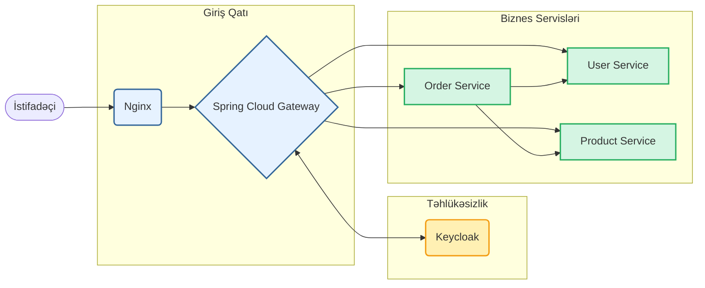

# Mikroservis Arxitekturalı Tətbiq

[](https://www.java.com)
[](https://spring.io/projects/spring-boot)
[](https://www.docker.com/)
[](https://opensource.org/licenses/MIT)

Spring Boot, Docker və Keycloak ilə qurulmuş, təhlükəsiz və müasir mikroservis arxitekturası.

## 🏗️ Arxitektura Sxemi



## 🚀 Sürətli Başlanğıc (Quick Start)

Layihəni 3 addıma işə salın.

**Tələblər:** Docker və Java (JDK 21) qurulmalıdır.

1.  **Layihəni klonlayın:**
    ```bash
    git clone <repository-url>
    cd microservice-app-main
    ```

2.  **Layihəni build edin:**
    ```bash
    ./gradlew build
    ```

3.  **Docker ilə başladın:**
    ```bash
    docker-compose up --build -d
    ```

Sistem bir neçə dəqiqəyə hazır olacaq. `docker-compose ps` ilə servislərin statusunu yoxlayın.

## 🔑 Əsas Ünvanlar

| Xidmət                  | Ünvan                                                 |
| ----------------------- | ----------------------------------------------------- |
| **Keycloak Admin**      | `http://localhost:8080` (admin / admin)               |
| **User Service API**    | `http://localhost/user-service/swagger-ui/index.html`   |
| **Product Service API** | `http://localhost/product-service/swagger-ui/index.html`|
| **Order Service API**   | `http://localhost/order-service/swagger-ui/index.html`  |

---

<details>
<summary>📖 Daha Ətraflı Məlumat (Texniki Detallar)</summary>

### ⚙️ API İstifadə Nümunələri (Workflow)

**1. Autentifikasiya (JWT Token almaq):**
```bash
# ADMIN istifadəçisi ilə token alırıq
TOKEN=$(curl -s -X POST http://localhost/user-service/api/v1/auth/login \
-H "Content-Type: application/json" \
-d '{"username": "admin@example.com", "password": "admin123"}' | jq -r .access_token)
```

**2. Qorunan Endpoint-ə müraciət (Məhsulları siyahılamaq):**
```bash
curl -X GET http://localhost/product-service/api/v1/products \
-H "Authorization: Bearer $TOKEN"
```

### 🧪 Testlərin İcra Edilməsi

**Bütün testləri icra etmək:**
```bash
./gradlew test
```

**Müəyyən bir servis üçün testləri icra etmək:**
```bash
./gradlew :order-ms:test
```

### 💻 Texnologiya Steki

- **Backend:** Java 21, Spring Boot 3.x, Spring Cloud
- **Təhlükəsizlik:** Keycloak, Spring Security (OAuth2/JWT)
- **Verilənlər Bazası:** MySQL 8.0
- **API Gateway:** Spring Cloud Gateway
- **Konteynerləşdirmə:** Docker, Docker Compose
- **API Sənədləşdirmə:** SpringDoc OpenAPI 3

### 🛠️ Nasazlıqların Aradan Qaldırılması

- **Servis işə düşmürsə:** `docker-compose logs <service-name>` ilə loqlara baxın.
- **401 Unauthorized xətası:** JWT tokenin `Authorization` başlığına düzgün əlavə edildiyindən əmin olun.

</details>

## 📄 Lisenziya

Bu layihə MIT Lisenziyası altında lisenziyalaşdırılıb. Ətraflı məlumat üçün `LICENSE` faylına baxın.

