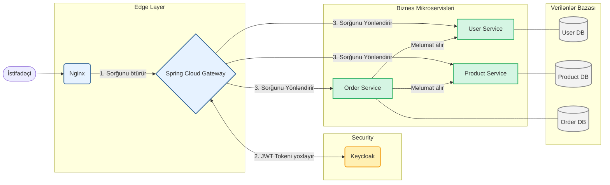

# Mikroservis Arxitekturalı Tətbiq

[](https://www.java.com)
[](https://spring.io/projects/spring-boot)
[](https://www.docker.com/)
[](https://www.keycloak.org/)
[](https://opensource.org/licenses/MIT)

Bu layihə, Spring Boot, Spring Cloud, Docker və Keycloak istifadə edərək qurulmuş müasir bir mikroservis tətbiqidir. Sistem, mərkəzləşdirilmiş autentifikasiya, servis yönləndirmə (routing), yük balanslaşdırma (load balancing) və hər servis üçün müstəqil verilənlər bazası kimi xüsusiyyətlərə malikdir.

## 🏗️ Arxitektura Baxışı

Sistem, bir neçə müstəqil işləyən mikroservisdən ibarətdir. Bütün sorğular Nginx və Spring Cloud Gateway üzərindən keçərək təhlükəsizlik yoxlamasından sonra aid olduğu servisə yönləndirilir.



## 💻 Texnologiya Steki

- **Backend:** Java 21, Spring Boot 3.x, Spring Cloud
- **Təhlükəsizlik:** Keycloak, Spring Security (OAuth2/JWT)
- **Verilənlər Bazası:** MySQL 8.0 (hər servis üçün ayrı instans)
- **API Gateway:** Spring Cloud Gateway
- **Servis Kommunikasiyası:** Spring Cloud OpenFeign
- **Konteynerləşdirmə:** Docker, Docker Compose
- **API Sənədləşdirmə:** SpringDoc OpenAPI 3
- **Monitorinq:** Spring Boot Actuator
- **Build Aləti:** Gradle 8.x

## 🚀 İcra Etmə (Getting Started)

### İlkin Tələblər
- JDK 21
- Docker & Docker Compose
- Gradle 8.x
- `jq` (JSON emalı üçün command-line aləti, API nümunələri üçün tövsiyə olunur)

### Quraşdırma Addımları

1.  **Layihəni klonlayın:**
    ```bash
    git clone <repository-url>
    cd microservice-app-main
    ```

2.  **Bütün servisləri build edin:**
    ```bash
    ./gradlew clean build
    ```

3.  **Sistemi başladın:**
    ```bash
    docker-compose up --build -d
    ```
    > **Qeyd:** `-d` (detached mode) ilə servislər arxa fonda işləyəcək. Loqları izləmək üçün `docker-compose logs -f` istifadə edin.

4.  **Servislərin hazır olmasını yoxlayın:**
    Sistemin tam işə düşməsi bir neçə dəqiqə çəkə bilər. 
    ```bash
    curl http://localhost/user-service/actuator/health
    ```

## ⚙️ API İstifadə Nümunələri (Workflow)

Aşağıdakı addımlar, bir istifadəçinin sistemlə necə qarşılıqlı əlaqədə olduğunu göstərir.

**1. Autentifikasiya (JWT Token almaq):**
```bash
# ADMIN istifadəçisi ilə token alırıq
# Qeyd: Windows-da 'jq' üçün uyğun sintaksis istifadə edin və ya TOKEN-i manual olaraq kopyalayın.
TOKEN=$(curl -s -X POST http://localhost/user-service/api/v1/auth/login \
-H "Content-Type: application/json" \
-d '{"username": "admin@example.com", "password": "admin123"}' | jq -r .access_token)

echo "Alınan Token: $TOKEN"
```

**2. Qorunan Endpoint-ə müraciət (Məhsulları siyahılamaq):**
```bash
curl -X GET http://localhost/product-service/api/v1/products \
-H "Authorization: Bearer $TOKEN"
```

**3. Yeni məhsul yaratmaq (Yalnız ADMIN):**
```bash
curl -X POST http://localhost/product-service/api/v1/products/admin \
-H "Content-Type: application/json" \
-H "Authorization: Bearer $TOKEN" \
-d '{"name": "Yeni Laptop", "description": "Güclü bir laptop", "price": 1500.00, "stock": 10}'
```

## 🧪 Testlərin İcra Edilməsi

Hər bir mikroservisin öz unit və inteqrasiya testləri mövcuddur.

**Bütün testləri icra etmək:**
```bash
./gradlew test
```

**Müəyyən bir servis üçün testləri icra etmək (məsələn, order-service):**
```bash
./gradlew :order-ms:test
```

## 🔄 CI/CD (Davamlı İnteqrasiya və Çatdırılma)

Bu layihə, CI/CD pipeline-ları ilə tam uyğundur. Nümunə bir GitHub Actions workflow-u `.github/workflows/ci.yml` faylında konfiqurasiya edilə bilər:

1.  **Push/Pull Request:** Kod repozitoriyaya push edildikdə workflow başlayır.
2.  **Build & Test:** `./gradlew build test` əmrləri ilə bütün servislər yoxlanılır.
3.  **Docker Image:** Uğurlu testlərdən sonra hər servis üçün Docker imicləri yaradılır və reyestrə yüklənir.
4.  **Deployment:** İmiclər production mühitində yenilənir.

## 🔐 Təhlükəsizlik və Keycloak

-   **Keycloak Admin Paneli:** `http://localhost:8080/`
-   **İstifadəçi adı:** `admin`, **Şifrə:** `admin`
-   **Realm:** `microservice-realm` (avtomatik import edilir)
-   **Test İstifadəçiləri:**
    -   **admin:** `admin@example.com` / `admin123` (Rollar: `ADMIN`, `USER`)
    -   **user:** `user@example.com` / `user123` (Rol: `USER`)

## 📚 API Sənədləşdirməsi (Swagger)

| Servis          | Swagger UI Ünvanı                                       |
| --------------- | ------------------------------------------------------- |
| **User Service**    | `http://localhost/user-service/swagger-ui/index.html`   |
| **Product Service** | `http://localhost/product-service/swagger-ui/index.html`|
| **Order Service**   | `http://localhost/order-service/swagger-ui/index.html`  |

## 🛠️ Nasazlıqların Aradan Qaldırılması (Troubleshooting)

-   **Servis işə düşmürsə:** `docker-compose logs <service-name>` ilə loqlara baxın.
-   **401 Unauthorized xətası:** JWT tokenin `Authorization` başlığına düzgün əlavə edildiyindən əmin olun.

## 📄 Lisenziya

Bu layihə MIT Lisenziyası altında lisenziyalaşdırılıb. Ətraflı məlumat üçün `LICENSE` faylına baxın.